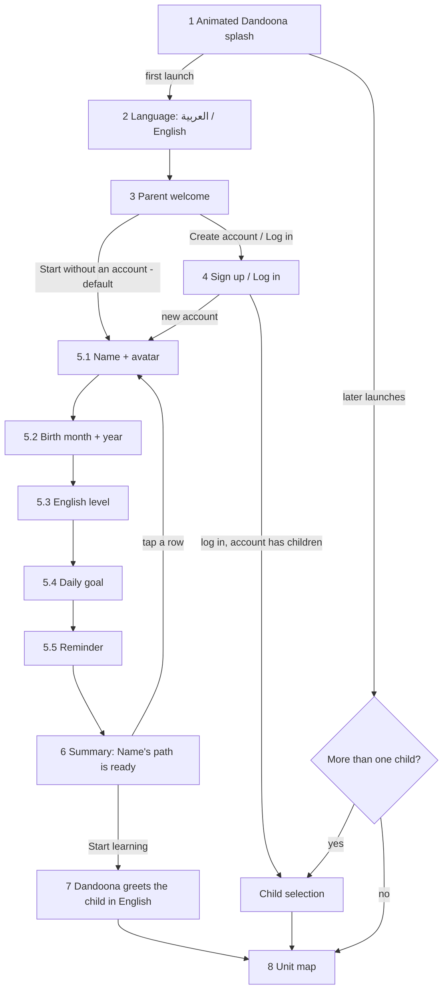

# First-launch experience: flow and screens (for approval, logic not wired yet)

Written for the project owner. Screens are real widgets (UI only, no storage, no network yet). Screenshots: `docs/design-options/onboarding/`
(`sheet-ar.png` and `sheet-en.png` show all screens; the single files are `ar_*.png` and `en_*.png`).

## Flow

Every question screen has a back arrow that keeps earlier answers, a Continue button that stays disabled until an answer is chosen,
and Dandoona in a different pose (waving, jumping, thinking, pointing, clapping; glasses on the level screen, a party hat on the summary).
The progress bar covers 5.1 to 5.5 and is full on the summary.

## Screens

| # | Screen | Pose | Notes |
|---|---|---|---|
| 1 | Splash | base | already built (`docs/screenshots/android-splash-sequence.png`) |
| 2 | Language | waving | both names in their own language, phone language pre-selected, direction follows the choice at once |
| 3 | Parent welcome | jumping | "Start without an account" is the default; the account can be created later in settings (local children and progress are uploaded then) |
| 4 | Sign up / Log in | pointing / thinking | email, password, optional first name, two required boxes (parent or guardian aged 18+; privacy policy and terms with links) |
| 5.1 | Name + avatar | base | nickname only, 8 drawn avatars |
| 5.2 | Birth month and year | thinking | shows the track that follows from the age |
| 5.3 | English level | pointing, glasses | four parent-friendly answers, no CEFR |
| 5.4 | Daily goal | clapping | 5 / 10 / 15 minutes, becomes the session timer |
| 5.5 | Reminder | waving | morning / afternoon / evening, or "Remind me later"; permission only after tapping "Remind me" |
| 6 | Summary | clapping, party hat | rows for track, starting point, goal, reminder; each row edits |
| 7 | Child greeting | jumping | English, left to right: "Hi, Omar! I'm Dandoona!" |
| 8 | Unit map | | already built (`docs/screenshots/android-unit-map.png`) |

## What I will build after your approval (each part its own commit)
1. **Language** screen and the saved choice; settings change (behind the gate) updates the UI at once. The localization test that fails when a key is missing in either language already exists and covers every new key.
2. **Parent welcome + account** screens; sign-up fields; consent timestamps stored on the server (see questions); `IEmailSender` with a development implementation that writes the email to the log (password reset and email verification endpoints use it); log-in brings the family's children and progress (already built) and goes to child selection.
3. **Child onboarding** (5.1 to 5.5) and the summary, wired to the child profile: birth month and year (the profile keeps the year plus the month), the existing track resolver, level to starting unit through a content file `content/curriculum/placement.yaml` (for example "Knows all letters" marks Letters as done by placement and starts at Colors), daily goal to the session timer, local reminder.
4. **Child greeting** with one generic line in Dandoona's voice from the asset tool ("Hi! I'm Dandoona! Let's learn English together!", about 50 characters, well under 1 US cent) plus the name on screen.
5. **Later launches** (splash, child selection only with more than one child, unit map); existing children skip onboarding; re-run from child settings.
6. Docs: `privacy-data-map.md`, `store-compliance.md`, and the privacy policy draft pages.

## Data we do not collect
Phone number, address, location, school, the child's full name, the child's photo, the child's gender, interests. Stored for a child: nickname, avatar, birth month and year, English level (only to place them), daily goal, reminder time. Account deletion stays in settings behind the gate.

## Questions for you
1. **Avatars "Dandoona and friends"**: I have Dandoona and five of her poses, but no art of friends. Option A (recommended): I draw 6 simple friend avatars as SVG (bunny, cat, bear, owl, fish, puppy) in the palette, plus Dandoona. Option B: generate them with OpenAI from her style (about 0.5 USD, but the look may drift). Which one?
2. **Notifications change the permissions**: reminders need `POST_NOTIFICATIONS` (asked only on screen 5.5) and `RECEIVE_BOOT_COMPLETED` (to schedule again after a restart); I will avoid the exact-alarm permission (the reminder may arrive a few minutes late). The release manifest would then have 4 permissions instead of 2; store compliance and the privacy docs will say so. OK?
3. **Consent on the server**: to prove the two checkboxes I would add `GuardianConfirmedAt` and `TermsAcceptedAt` to the parent account (a database migration). OK?
4. **Privacy policy and terms links**: the policy exists as a draft HTML page, the terms do not. Until you host them I will show them in the app as simple text pages. Do you want me to write a draft terms page too (for legal review)?
5. **Birth month**: only the birth year is stored today. Storing the month too (needed for exact age) is a small change to the child profile and the server. OK?
